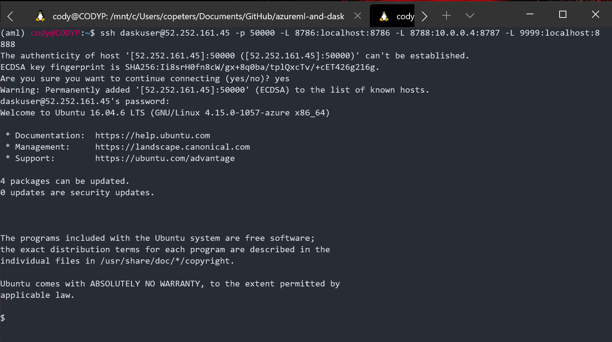
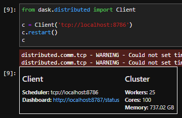
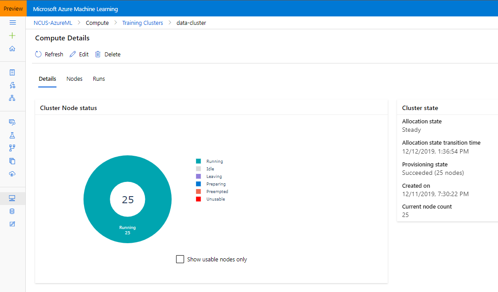
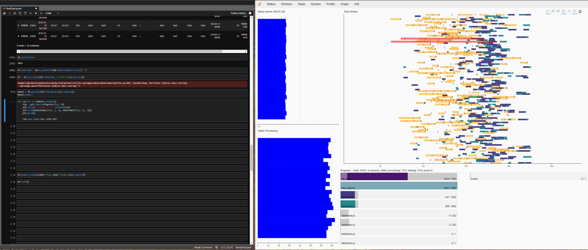
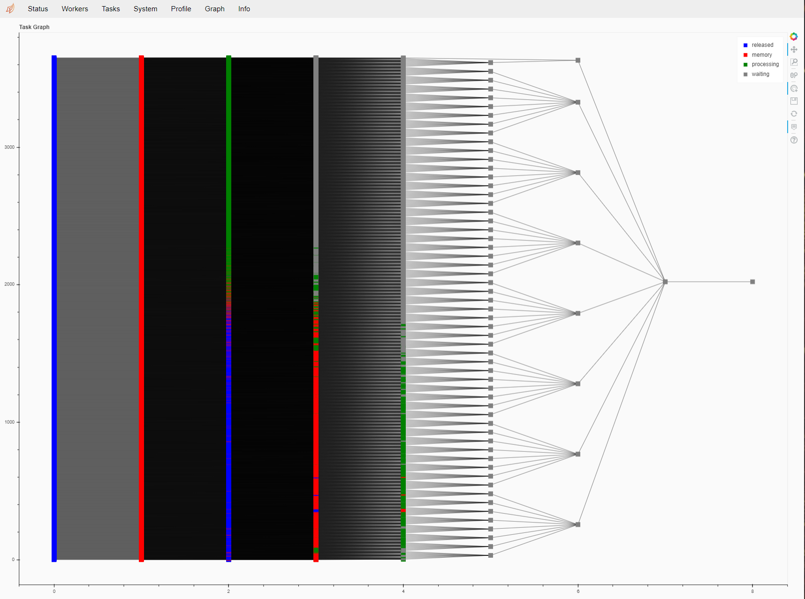

# Dask on Azure ML Cluster

Dask can be setup on Azure ML clusters to provide distributed Python functionality. Most relevant to Azure ML are the data preparation and visualization capabilities (distributed Pandas, matplotlib) and machine learning (distributed sklearn, xgboost, lightgbm). However, Dask is flexible and can be used to distribute generic Python workloads. 

## Cluster setup

You need to be able to SSH to the cluster to connect the Dask client and access the Dask dashboard. Be sure to setup a Username and Password or SSH key. This will be used to enable port forwarding.

Once you have a cluster you can SSH into, we run a simple `startDask.py` script in an Azure ML `Estimator` which we submit to the cluster and wait for the setup to complete. 

Notice we also provide a datastore, which in this case contains ~150 GB of csv files. This blob datastore is mounted to the cluster and can be used like any local files.

At this point, we need to establish port forwarding for the Dask scheduler, bokeh app, and Jupyter lab instance running on the cluster.

Setup is complete, and we're ready to use Dask on an Azure ML cluster! 

## Use the Dask cluster

The Dask cluster can be used from a local Jupyter notebook relative to the port forwarding. Note this can also be setup in a Notebook VM.

Simply connect to the localhost with a Dask client.

In this case, I am using a 25 node D12_v2 cluster, giving me 100 cores and ~700 GB of memory. I can see my cluster and run in the Azure ML portal.

## Playing with Dask

I can open up my Dask dashboard (bokeh app) side by side with my code to see the status of my operations. 

There are many features in the dashboard to explore. My personal favorite is the graph, which let's you see the DAG of the job and the status at each node.

