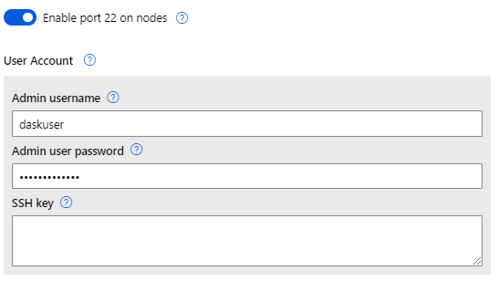
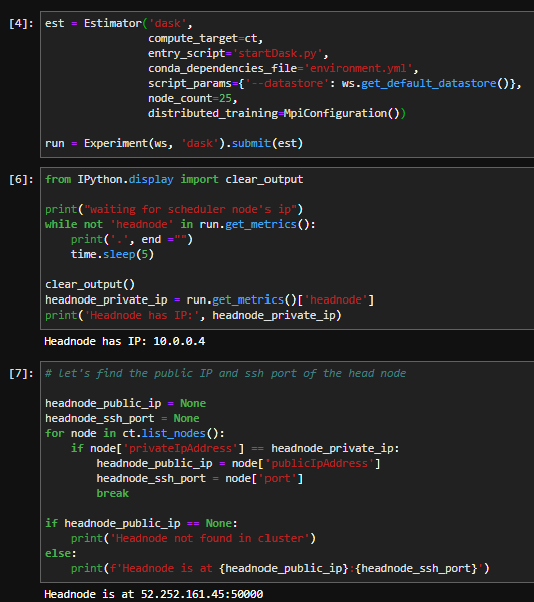

# Dask on Azure ML Cluster

Dask can be setup on Azure ML clusters to provide distributed Python functionality. Most relevant to Azure ML are the data preparation and visualization capabilities (distributed Pandas, matplotlib) and machine learning (distributed sklearn, xgboost, lightgbm). However, Dask is flexible and can be used to distribute generic Python workloads. 

## Cluster setup

You need to be able to SSH to the cluster to connect the Dask client and access the Dask dashboard. Be sure to setup a Username and Password or SSH key. This will be used to enable port forwarding.

Once you have a cluster you can SSH into, we run a simple `startDask.py` script in an Azure ML `Estimator` which we submit to the cluster and wait for the setup to complete. 

