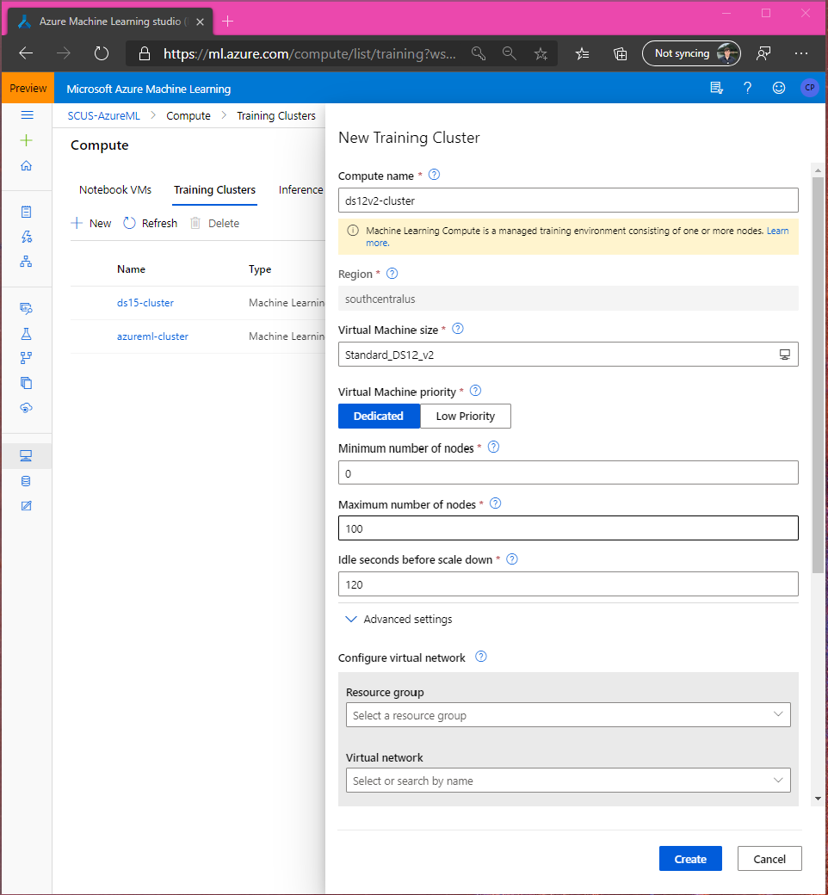
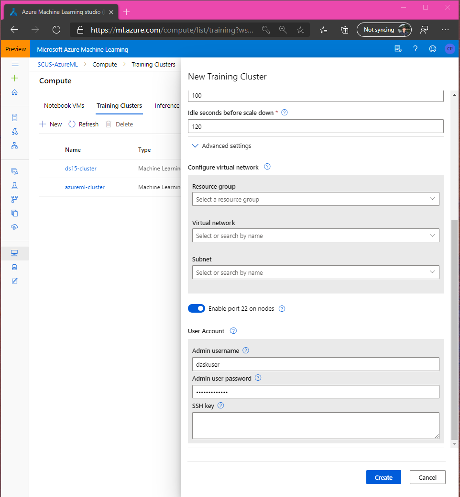

# Dask on Azure ML Cluster

Dask can be setup on Azure ML clusters to provide distributed Python functionality. Most relevant to Azure ML are the data preparation and visualization capabilities (distributed Pandas, matplotlib) and machine learning (distributed sklearn, xgboost, lightgbm). However, Dask is flexible and can be used to distribute generic Python workloads. 

## Introduction

The Azure Machine Learning service is an enterprise-grade ML platform built for productive data science and ML engineering. Dask "is a flexible library for paralell computing in Python," and importantly for us extends the commonly used open source NumPy, Pandas, and Scikit-Learn interfaces to run at scale. With the power of both, we can easily spin up and tear down a powerful data processing and ML cluster.

In this blog, we will setup an Azure ML cluster with ~1 TB of memory to perform exploratory data analysis (EDA) and data preparation for machine learning using Dask on a ~500 GB dataset. This is not intended to be a guide to Azure ML or Dask and assumes you have an Azure ML workspace setup. If you do not have a workspace, you can [create one for free](https://azure.microsoft.com/pricing/details/machine-learning/). For reference materials, see:

* [Azure ML documentation](https://docs.microsoft.com/azure/machine-learning/)
* [Dask documentation](https://docs.dask/org/latest/)
* [AzureML and Dask Blog Github Repository](https://aka.ms/daskbloggit)

The contents in this blog are adapted from [this github repository](https://github.com/danielsc/azureml-and-dask) by my colleague Daniel.

## Cluster creation

We'll start in the Azure Machine Learning studio by setting up our cluster. Of course, this can be done programmatically with either the [Azure ML Python SDK](https://docs.microsoft.com/python/api/overview/azure/ml/intro?view=azure-ml-py) or [Azure ML CLI](https://docs.microsoft.com/azure/machine-learning/service/reference-azure-machine-learning-cli). 

Head over to the Compute tab on the left side navigation, and create a new Training Cluster. I recommend using the `Standard_DS12_v2` VM or similar. **Do not** create the cluster until heading into the advanced settings so you can SSH into the cluster. 

It is strongly recommended to set the minimum nodes to 0 so the cluster scales down automatically and you are not charged when it is not being used. I will set my maximum nodes to 100, although we'll only use 50 in this blog, giving us plenty of memory.



To access the cluster remotely, configure an admin username and password or SSH key. In the code later, we will assume the username is `daskuser`.



Now, create the cluster. This will only take about a minute. With the cluster ready, we'll run a simple script to set it up.

## Cluster setup for Dask

First, setup your conda environment. It is best practice to use the same `environment.yaml` you will pass to the cluster setup step so the environments match. This will avoid any mismatched versions between your local environment and the environment running on the cluster. Create a new environment from [the provided file]().

```
conda env create -f environment.yaml
conda activate dask
n -m ipykernel install --user --name dask --display-name "Python (dask)"
```

and startup a Jupyter Lab session:

```
jupyter lab
```


## Connecting to the cluster 
